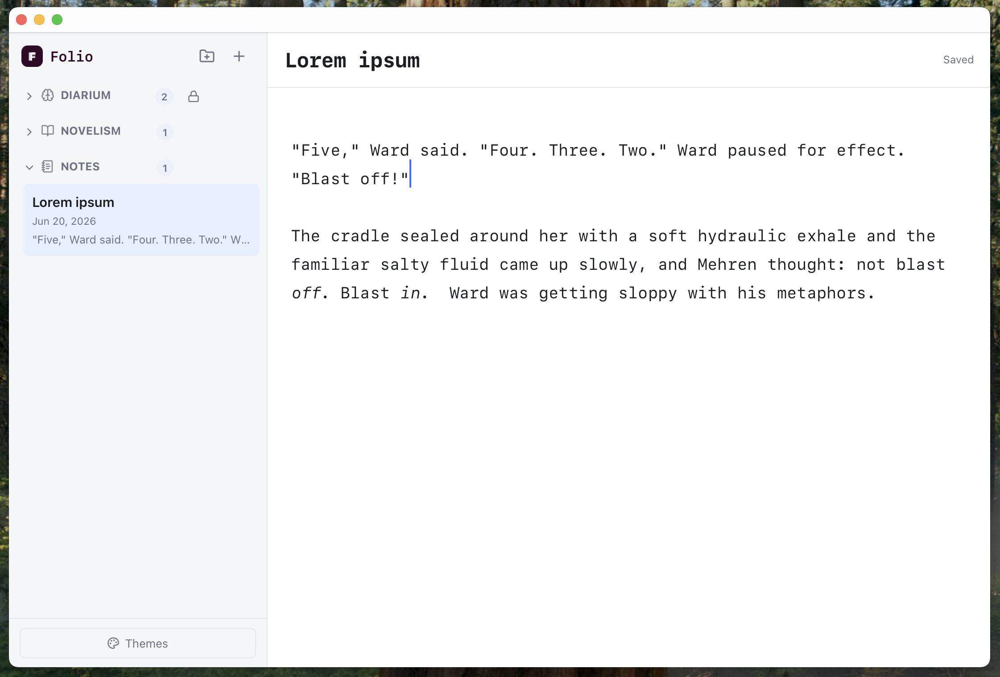
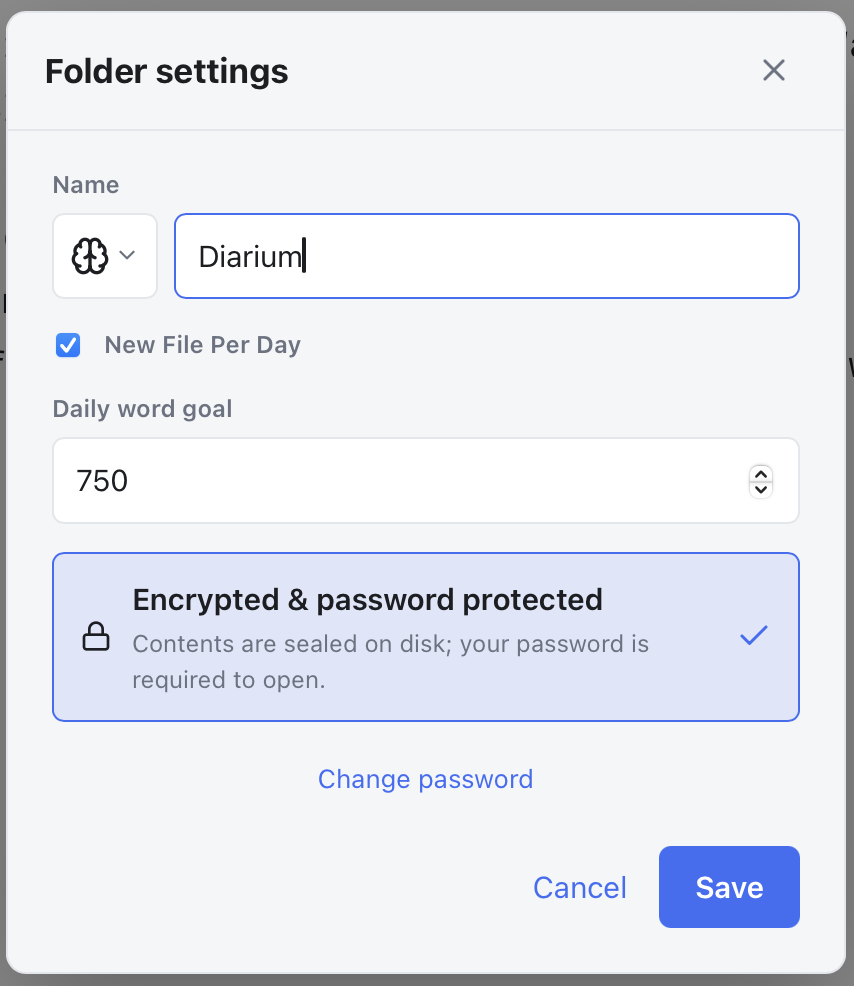
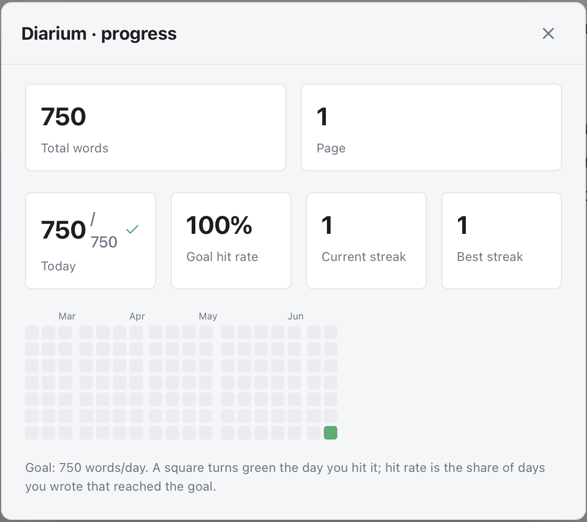

# 📖 Folio

**A private, local-first markdown journal for your desktop.**

Folio is a native desktop app for keeping notes, journals, and diaries in plain
Markdown — with optional, password-protected **encryption on a per-folder
basis**. Your writing lives on your own machine. There is no account, no sync,
and no cloud. Nothing ever leaves your computer.

> Open the app and start writing immediately — no login, no setup. Lock down the
> folders that hold your private thoughts whenever you want.



---

## ⬇️ Installing

Folio is a regular desktop app — no command line needed to use it.

**[➡️ Download the latest version from the Releases page](https://github.com/kkauff/folio/releases/latest)**

Pick the file that matches your computer:

| Your computer | Download this | How to install |
| --- | --- | --- |
| **Mac** | `Folio_…_x64.dmg` (Intel) or `Folio_…_aarch64.dmg` (Apple Silicon) | Open the `.dmg`, then drag **Folio** into your **Applications** folder. |
| **Windows** | `Folio_…_x64-setup.exe` (or `.msi`) | Double-click it and follow the installer. |
| **Linux** | `Folio_…_amd64.AppImage` | Make it executable (`chmod +x`) and double-click, or install the `.deb`. |

> 💡 **Not sure which Mac you have?** Click the  menu → **About This Mac**. If it
> says "Apple M1/M2/M3…" choose the Apple Silicon (`aarch64`) file; otherwise
> choose the Intel (`x64`) file.

### First time you open it

Folio isn't yet signed with a paid developer certificate, so your system shows a
one-time security warning. This is expected for a new open-source app — here's
how to get past it.

**Mac** — you may see *"Apple could not verify Folio is free of malware…"*. Drag
**Folio** into your **Applications** folder first, then:

1. Double-click **Folio**, and click **Done** on the warning.
2. Open  menu → **System Settings → Privacy & Security**.
3. Scroll to **Security**, find *"Folio" was blocked…*, and click **Open Anyway**
   (confirm with Touch ID or your password). Folio opens normally from then on.

> Prefer the terminal? This does the same thing in one line:
> `xattr -dr com.apple.quarantine /Applications/Folio.app`

**Windows** — if *"Windows protected your PC"* appears, click **More info → Run
anyway**.

---

## ✨ Features

- **✍️ Distraction-free Markdown editor** — write in plain Markdown and watch it
  format inline as you type (built on CodeMirror, with GitHub-flavored Markdown).
  Entries save automatically.
- **🗂️ Folders & organization** — group entries into folders, each with its own
  icon. Move entries between folders; flat and simple, no deep nesting to manage.
- **🔒 Opt-in, per-folder encryption** — flag any folder as encrypted and its
  entries are sealed at rest with **AES-256-GCM**. Unencrypted folders stay as
  fast, readable plain files. One app password unlocks all encrypted folders.
- **📔 Diary mode** — turn any folder into a daily journal: Folio auto-creates a
  page for each day and can track a **daily word goal**, with writing stats,
  streaks, and a contribution-style heatmap of the days you hit your goal.
- **🎨 Themes** — ships with **Light**, **Dark**, and **Sepia**, plus a theme
  editor for designing and saving your own custom color schemes.
- **🔤 Typography controls** — choose from Serif, Sans, Humanist, Rounded, or
  Monospace reading fonts and adjust the text size to taste.
- **🖥️ A real native app** — a small, fast Tauri binary.
- **🛜 100% offline & local** — no telemetry, no network calls, no servers. Your
  journal is just files in a folder on your disk.

---

## 📸 A closer look

**Per-folder settings** — give a folder an icon, make it a daily journal with a
word goal, and toggle encryption on or off whenever you like.



**Progress & streaks** — diary folders track your total words, daily goal, hit
rate, current and best streaks, and a heatmap that turns green on the days you
reach your goal.



---

## 🔐 How encryption works

Folio is **plaintext by default** so it's instantly usable, and lets you encrypt
exactly the folders that need it.

- Mark a folder **encrypted** and set a single **app password**.
- Your password is stretched into a 256-bit key with **Argon2id** (memory-hard,
  resistant to GPU/ASIC brute-force).
- Each encrypted entry's title and body are sealed with **AES-256-GCM**, an
  authenticated cipher — a wrong password fails cleanly instead of returning
  garbage, and tampering is detected.
- The key exists **only in memory** while you're unlocked, and is wiped
  (zeroized) when you lock the app or quit.
- Folder names and entry dates stay readable so the sidebar still works while
  encrypted entries are locked; only the **content and titles** inside encrypted
  folders are sealed.

> ⚠️ **There is no recovery and no backdoor.** If you forget your app password,
> encrypted entries cannot be opened. That is the entire point — but it means
> your password is yours alone to keep safe.

### Where your data lives

Folio stores everything as plain files under your OS's standard app-data
directory (bundle id `com.eitak.folio`):

| OS          | Location                                               |
| ----------- | ------------------------------------------------------ |
| **macOS**   | `~/Library/Application Support/com.eitak.folio/store/` |
| **Linux**   | `~/.local/share/com.eitak.folio/store/`                |
| **Windows** | `%APPDATA%\com.eitak.folio\store\`                     |

```
store/
├── secret.json          # Argon2 salt + verifier — never the password or key
├── folders.json         # folder names, icons & settings (plaintext)
└── entries/
    └── <uuid>.json       # one entry each: metadata plaintext, body sealed if encrypted
```

You can confirm encryption yourself: open an entry file from an encrypted folder
and you'll see only a base64 `payload` blob — no readable title or text. Entries
in unencrypted folders show their `title` and `content` in the clear.

---

## 🖥️ Platform support

Folio is built with [Tauri 2](https://tauri.app) and targets **macOS, Windows,
and Linux** from a single codebase. It is developed and tested primarily on
macOS; Windows and Linux builds are produced from the same source.

---

## 🧱 Tech stack

| Layer    | Choice                                                    |
| -------- | --------------------------------------------------------- |
| Shell    | [Tauri 2](https://tauri.app) — native, small footprint    |
| Frontend | React 19 + TypeScript + Vite                              |
| Editor   | CodeMirror 6 + `react-markdown` + `remark-gfm`            |
| Backend  | Rust — all cryptography and disk I/O                      |
| Crypto   | `argon2` (Argon2id) + `aes-gcm` (AES-256-GCM) + `zeroize` |

---

## 🚀 Development

Prerequisites: **Node.js**, **Rust** (via [`rustup`](https://rustup.rs)), and
your platform's Tauri build dependencies (on macOS, Xcode Command Line Tools).

```bash
npm install
npm run tauri dev      # run the app with hot reload
```

Run the Rust test suite (crypto + storage round-trips):

```bash
cd src-tauri && cargo test
```

## 📦 Building a distributable

```bash
npm run tauri build    # outputs installers under src-tauri/target/release/bundle/
```

On macOS this produces a `.app` and `.dmg`; on Windows an `.msi`/`.exe`; on
Linux `.deb`/`.AppImage`.

---

## 🗂️ Project layout

```
src/                     React frontend
  lib/api.ts             typed wrappers around the Rust commands
  lib/themes.ts          theme tokens + custom-theme storage
  lib/stats.ts           word counts & daily-page helpers
  components/            Sidebar, Editor, ThemePanel, PasswordPrompt, …
src-tauri/src/
  crypto.rs              Argon2id key derivation + AES-256-GCM
  vault.rs               folder/entry storage + per-folder sealing
  lib.rs                 Tauri commands; holds the key in memory
```

---

## 📄 License

Folio is open source under the [MIT License](./LICENSE).

It bundles the **Monoton** typeface under the SIL Open Font License 1.1, and
builds on other open-source libraries. See [`NOTICE.md`](./NOTICE.md) for full
third-party attributions.
